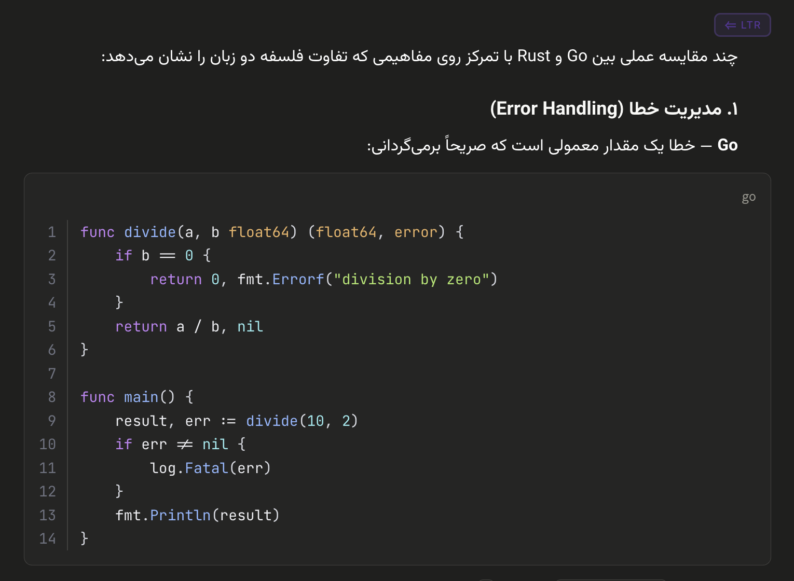
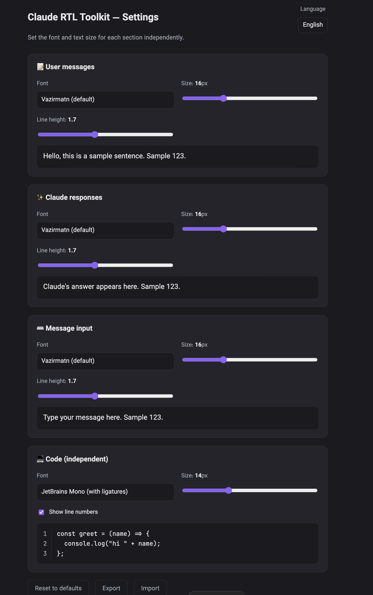
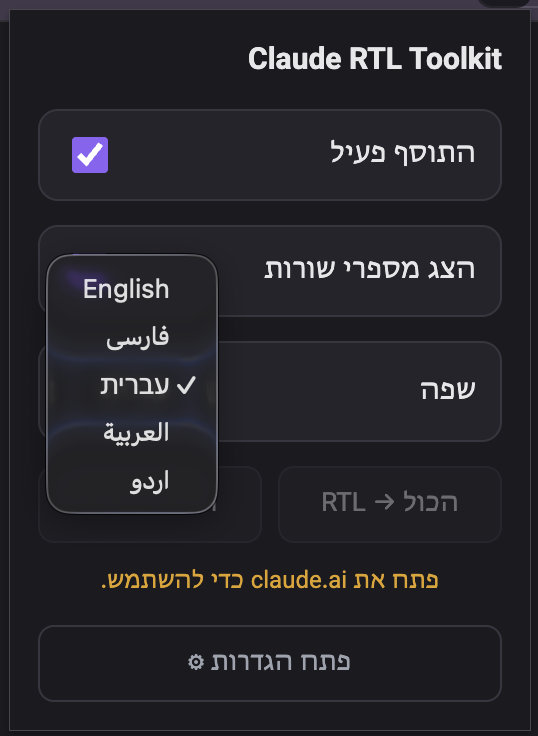

**English** | [فارسی](README.fa.md)

# Claude RTL Toolkit

A Chrome / Brave / Firefox extension that gives [claude.ai](https://claude.ai) real right-to-left (RTL) support and per-section typography control.

> Multilingual: Persian, Arabic, Hebrew, Urdu, and English — in both text auto-detection and the UI.

---

## What it is

A toolbar extension that lets you, on any Claude conversation:

**Direction**
- 🔄 Flip **each message** between RTL and LTR with a chip above it.
- 🔍 **Auto-detect** RTL scripts (Persian, Arabic, Hebrew, Syriac, Thaana, N'Ko, presentation forms).
- ⌨️ Toggle the last message with `Alt+Shift+R`; the composer follows what you type, per line.
- 💾 Remember your choices across reloads and devices (`chrome.storage.sync`).

**Typography**
- 🔤 Independent **font / size / line-height** for user messages, Claude responses, the composer, and code.
- 📦 Bundled fonts: Vazirmatn & Estedad (Persian), Rubik (Hebrew + Latin), JetBrains Mono (code, with ligatures).

**Code**
- 💻 Code blocks stay **strictly LTR** even with RTL comments (`unicode-bidi: isolate`).
- 🔢 Optional line numbers with a precisely aligned gutter.

**Interface**
- 🌍 5-language UI · 🎛️ popup (on/off, set-all, line numbers, language, health) · 📤 export/import · 🎨 auto light/dark.

---

## Screenshots

<p align="center">
  
</p>

<table>
  <tr>
    <td align="center"></td>
    <td align="center"></td>
  </tr>
  <tr>
    <td align="center"><sub>Settings — independent typography per section</sub></td>
    <td align="center"><sub>Popup — quick controls, 5 languages</sub></td>
  </tr>
</table>

---

## Why it exists

Claude is great at multilingual conversations — but the **interface** wasn't built for right-to-left text:

- **RTL text is left-aligned by default.** Ask Claude something in Persian, Arabic, or Hebrew and the answer renders left-to-right: punctuation lands on the wrong side, numbers and parentheses flip, and long paragraphs are hard to read.
- **Mixed content is the worst case.** Real answers interleave RTL prose with English terms, inline code, and code blocks. A naive page-wide RTL switch would *break the code* while only half-fixing the text.
- **No per-message control.** Some messages are English, some are Persian. A single global toggle can't be right for both — you need direction **per message**.
- **No typography control.** Default fonts render non-Latin scripts poorly, with cramped line-height that hurts readability for connected scripts like Persian and Arabic.
- **Nothing persists.** Even when a workaround exists, it resets on every reload.

**The approach:** fix it where it actually matters — *per message*, not globally. Auto-detect direction from the text but always allow a manual override; keep **code blocks LTR no matter what**; give independent typography to each kind of content; and remember every choice. The result reads like Claude was built for RTL in the first place.

---

## How to use it

First, clone this repo (or download it as a ZIP and unzip).

**Chrome / Brave**
1. Open `chrome://extensions` (or `brave://extensions`).
2. Enable **Developer mode** (top corner).
3. Click **Load unpacked** and select the `claude-rtl-toolkit` folder.

**Firefox**
1. Open `about:debugging#/runtime/this-firefox`.
2. Click **Load Temporary Add-on…** and pick the `manifest.json` inside the folder.

Then head to `claude.ai`.

> One manifest works in both browsers. Temporary Firefox add-ons are removed on restart — for a permanent install, grab it from the Chrome Web Store / Firefox Add-ons once published. After editing any file, reload the extension and refresh the tab.

### Everyday use

| Action | How |
|--------|-----|
| Flip one message | Click the **`⇒ RTL` / `⇐ LTR`** chip above the message |
| Flip the last message | `Alt+Shift+R` |
| Flip every message at once | Popup → "Set all RTL" / "Set all LTR" |
| Fonts / size / line-height | Popup → ⚙️ Settings |
| Turn the extension on/off | Popup → top switch |

### Settings

The options page has four sections — **User messages**, **Claude responses**, **Message input**, and **Code** (with a line-numbers toggle). Every change saves **automatically** and applies **live** (no refresh) to open tabs.

### Architecture

```
claude-rtl-toolkit/
├── manifest.json       # Extension definition (MV3): content script, popup, options, permissions
├── config.js           # Shared: storage keys, i18n dictionary, font list, defaults
├── content.js          # Core logic: message detection, direction, fonts, line numbers, shortcut
├── styles.css          # Static styles (chip, gutter, composer, code-LTR)
├── popup.html/css/js   # Quick-access menu on the toolbar icon
├── options.html/css/js # Full settings page
├── fonts/              # Bundled woff2 fonts
└── icons/
```

Key design decisions:
- **Storage-driven:** popup and options write the same `chrome.storage` keys; `content.js` reacts via `onChanged`. One source of truth, many access points.
- **Dynamic CSS over per-node mutation:** font settings compile to a single `<style>` element that's rewritten on change.
- **Override-only persistence:** for direction, only choices that differ from auto-detect are stored — small and within the `storage.sync` quota.
- **Layered, self-healing detection:** if Claude's DOM classes change, a content-anchored fallback recovers messages and a health check warns in the console.
- **Stable message IDs:** from a stable Claude attribute or a deterministic text hash (djb2), never random — so choices survive reloads.

### Fonts & licenses

All fonts are open source (SIL OFL) and bundled locally (the site's CSP blocks external font loading):

| Font | Use |
|------|-----|
| [Vazirmatn](https://github.com/rastikerdar/vazirmatn) | Persian/Arabic |
| [Estedad](https://github.com/aminabedi68/Estedad) | Persian |
| [Rubik](https://fonts.google.com/specimen/Rubik) | Hebrew + Latin |
| [JetBrains Mono](https://www.jetbrains.com/lp/mono/) | Code (ligatures) |

### Extending

- **Add a language:** one entry in `UI_LANGS` + one block in `I18N` (`config.js`).
- **Add a font:** drop the woff2 in `fonts/`, add an `@font-face` in `injectFont` (content.js), and an option in `FONT_OPTIONS` (config.js).
- **Selectors broke?** They all live in `SELECTORS` (`content.js`); the popup's indicator shows **0** when detection fails.

---

## Acknowledgments

- **[Vazirmatn](https://github.com/rastikerdar/vazirmatn)** is the successor of the **Vazir** font by the late **[Saber Rastikerdar](https://fa.wikipedia.org/wiki/%D8%B5%D8%A7%D8%A8%D8%B1_%D8%B1%D8%A7%D8%B3%D8%AA%DB%8C%E2%80%8C%DA%A9%D8%B1%D8%AF%D8%A7%D8%B1)** (صابر راستی‌کردار) — who gifted the Persian-speaking world a beautiful, free, open-source typeface. This project would not look the way it does without his work. Forever remembered. 🌹
- Fonts: [Estedad](https://github.com/aminabedi68/Estedad), [Rubik](https://fonts.google.com/specimen/Rubik), and [JetBrains Mono](https://www.jetbrains.com/lp/mono/).

---

## License

Released under the **[MIT License](LICENSE)** — free and open source.

Use it, modify it, fork it, ship it — for personal or commercial projects, however you like. No permission needed, no strings attached; the only ask is that you keep the copyright notice. The bundled fonts keep their own [OFL](https://openfontlicense.org/) licenses.
